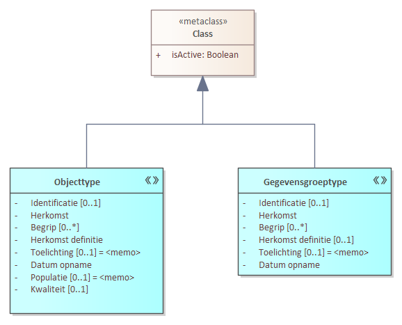

# Metamodel in UML

Beschrijf in dit hoofdstuk het MIM-profiel van deze modelleertaal of de toepassing van het MIM metamodel in deze modelleertaal.
Het is waarschijnliijk een mapping en extensie (of specialisatie) van MIM op deze modelleertaal.
Het resulterende profiel is conform MIM en conform deze modelleertaal.

## Inleiding

Dit hoofdstuk beschrijft hoe je met MIM (doc link) een informatiemodel maakt in UML. MIM en UML hebben beide een eigen metamodel. Aan beide kan ook niets worden veranderd. Voor de toepassing van MIM met de modelleertaal UML gaat het om een mapping van het MIM metamodel op het metamodel van UML. Dat resulteert in de creatie van UML-stereotypen als extensie op UML-metaklassen. De MIM modelelementen worden daarmee herkenbaar in UML en gespecificeerd met de metagegevens die in MIM gedefinieerd zijn. Een aantal daarvan kunnen gemapped worden op UML metagegevens, zoals bijvoorbeeld 'naam' en cardinaliteit, andere worden als tagged value toegevoegd.

## Structuur metamodel in UML

De eerste paragraaf bevat UML-diagrammen. Elk diagram toont een aantal modelelementen. Het geheel van diagrammen, in samenhang, is opgenomen in bijlage [[[#diagrammen]]]. Uitgangspunten voor het metamodel in UML zijn:

 - UML 2.5.1 geldt als de UML versie waar deze specificatie aan conformeert.
 - Het UML metamodel en daarin voorkomende UML-modelelementen of metaklassen geldt als uitgangspunt.
 - De MIM metaklassen worden gerelateerd aan UML metaklassen en zijn indien nodig een extensie daarvan. Extensies bevatten extra metagegevens en worden gerealiseerd middels stereotypen van die UML metaklassen.
 - Twee verschillende stereotypen hebben nooit dezelfde betekenis. 
 - Stereotypen worden toegepast als er een verbijzondering van een UML-constructie nodig is met behoud van de betekenis van de UML-metaklasse.
((((Elk modelelement heeft een MIM metaclass. Deze wordt met UML in een
informatiemodel gemodelleerd als een extensie van een Metaclass van UML 2.5 en een bijbehorende
stereotype.))))

## Structuur metamodel in UML

### Kern: objecten, eigenschappen, relaties

voorbeeld: 
<figure id="ExtendClass">
  
  <figcaption>MIM extend op UML-Class</figcaption>
</figure>

### Overzicht model MIM UML-profiel

Extensie van metamodel van UML. MIM-stereotypen als extensies van UML metaklassen.

<figure id="MIM-UML Profiel-overzicht">
  
  <figcaption>MIM extend op UML-metaklassen</figcaption>
</figure>

MIM-UML Profiel-overzicht

### Datatypen

### Overig

#### Constraint

#### Keuze

#### Packages

## Specificaties metagegevens in UML

